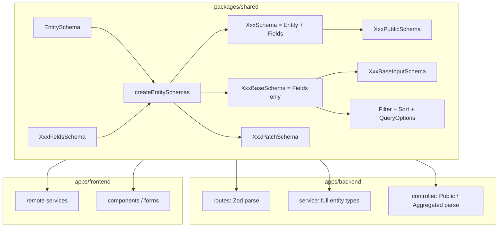
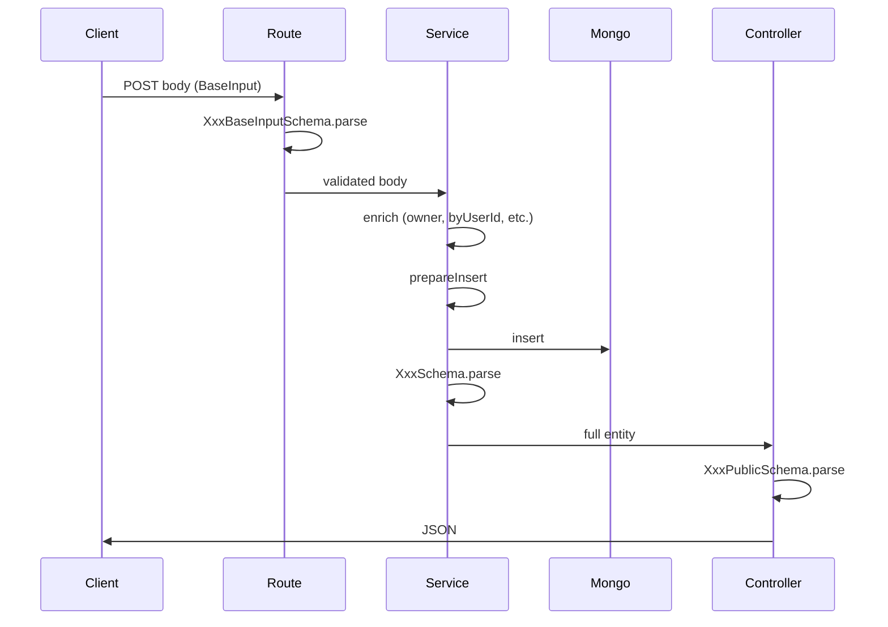
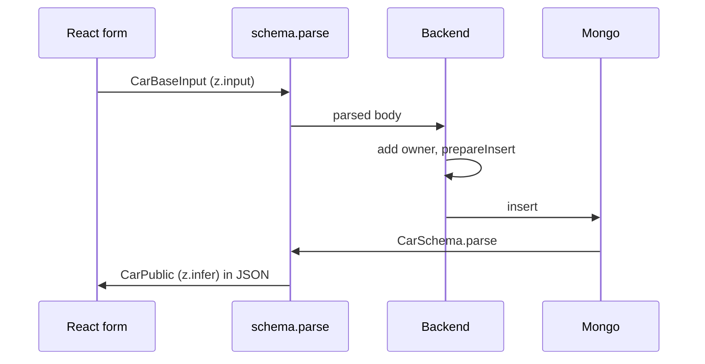

# Shared type system

This document describes how domain types are defined and used across the monorepo. **Car** and **Review** are the primary examples; **User** follows the same patterns. Related modules (`http.ts`, `abac.ts`) are referenced briefly at the end.

**Package:** `@cars/shared` (npm name). TypeScript path alias `@car/shared` resolves to the same entry in `tsconfig.base.json`.

---

## Principles

1. **Zod is the single source of truth.** Schemas live in `packages/shared/src/`. TypeScript types are derived with `z.infer` or `z.input`—never duplicated by hand.

2. **Export schemas and types together.** Call sites import both (e.g. `CarSchema` + `Car`) so validation and typing stay aligned.

3. **Parse at boundaries.** Validate when data crosses a trust boundary:
   - Express routes (body, query, params) via middleware
   - Service layer when reading from MongoDB
   - Controllers before sending JSON
   - Frontend HTTP clients when receiving responses
   - Forms before submit (optional but recommended with react-hook-form resolvers)

4. **Layered shapes, not one mega-type.** The same logical entity has different schemas for persistence, API input, API output, and list queries. Names encode that role.

---

## Architecture overview



**Intended usage:**

| Layer | Types |
|-------|--------|
| Mongo / backend service | `Car`, `Review` (full entity after `XxxSchema.parse`) |
| HTTP response to clients | `CarPublic`, `AggregatedReview` |
| HTTP request bodies (create/update) | `CarBaseInput`, `CarPatchInput`, etc. |
| List/query | `CarQueryOptions` (after parse) |

Today `CarPublic` is almost identical to `Car` because nothing is redacted yet. Client code should still prefer `*Public` / `AggregatedReview` so future field hiding does not require a sweeping rename.

---

## Entity layer

All top-level persisted entities share metadata defined in `entity.ts`.

### `EntitySchema`

```ts
{
  _id: string,           // via EntityIdSchema
  _createdAt: Date,      // z.coerce.date()
  _updatedAt: Date,
  _version: number,      // optimistic concurrency
}
```

### `EntityIdSchema`

Preprocesses MongoDB `ObjectId` instances to hex strings (duck-typed `toHexString`) so the shared package does not depend on the driver. Strings pass through unchanged.

### `Entity` type

`export type Entity = z.infer<typeof EntitySchema>`

Used generically (e.g. `byObjectId` in `db.service.ts`) for anything with `_id`.

### Metadata semantics

- **`prepareInsert`** (backend): sets `_createdAt`, `_updatedAt`, `_version: 1` on create.
- **`prepareUpdate`** (backend): requires `_id` and optional `_version` in patch; increments `_version`, touches `_updatedAt`, builds Mongo `$set` from remaining fields.

Patches that omit `_version` skip version check in criteria (see `prepareUpdate`).

---

## `createEntitySchemas`

Helper in `entity.ts` that standardizes how a new top-level entity is built from domain fields.

```ts
export function createEntitySchemas<T extends z.ZodRawShape>(dataShape: z.ZodObject<T>) {
  const fullSchema = EntitySchema.extend(dataShape.shape)
  const baseSchema = dataShape // semantic alias: fields only
  const patchSchema = dataShape.partial().extend({
    _id: EntitySchema.shape._id,
    _version: EntitySchema.shape._version,
  })
  return { fullSchema, baseSchema, patchSchema }
}
```

Given `XxxFieldsSchema`:

| Export | Schema | Type | Role |
|--------|--------|------|------|
| Full entity | `XxxSchema` | `Xxx` | Stored document + in-memory canonical shape |
| Create fields | `XxxBaseSchema` | `XxxBase` | Domain fields only (no entity metadata) |
| Update | `XxxPatchSchema` | `XxxPatch` / `XxxPatchInput` | Partial fields + required `_id`, `_version` |

### Backend flow (create / update / read)



---

## Naming convention

For each domain entity `Xxx`:

| Name | Meaning |
|------|---------|
| `XxxFieldsSchema` | Domain-only fields (no `_id`, dates, version) |
| `XxxSchema` | Full persisted entity |
| `XxxBaseSchema` | Same as fields; used for create payloads after route validation |
| `XxxBaseInputSchema` | Client create body: `Base` minus server-set fields |
| `XxxPatchSchema` | Partial update + `_id` + `_version` |
| `XxxPublicSchema` | Safe wire format (omit/redact sensitive fields) |
| `XxxFilterSchema` | List filter criteria |
| `XxxSortSchema` / `XxxSortFieldSchema` | Sort field + direction |
| `XxxQueryOptionsSchema` | `{ filterBy?, sortBy? }` |
| `XxxParamsSchema` | Route params (e.g. `{ id }`) |

Type exports mirror schema names: `Car`, `CarBaseInput`, `CarPublic`, etc.

---

## Car (reference entity)

**File:** `packages/shared/src/car.ts`

### Fields (`CarFieldsSchema`)

- `make`, `maxSpeed` (coerced number), `type` (enum), `owner` (MiniUser)
- Optional embedded arrays: `comments`, `likedBy`

### Variants

| Schema | Notes |
|--------|--------|
| `CarSchema` | Full car in DB |
| `CarBaseSchema` | All domain fields including `owner` |
| `CarBaseInputSchema` | `CarBase` **without** `owner` (server sets from auth) |
| `CarPatchSchema` | Partial car fields + `_id`, `_version` |
| `CarPublicSchema` | `CarSchema` with nested `CommentPublic` / `LikePublic` (currently identical to full) |

### Query types

```ts
CarFilterSchema   // txt?, minSpeed? (coerced), type?
CarSortSchema     // sortField?: 'make' | 'maxSpeed', sortDir: 1 | -1
CarQueryOptionsSchema // { filterBy?, sortBy? }
```

`sortDir` uses preprocess: `Number(val) || 1`, then `1 | -1`. Query strings from Express arrive as strings; coercion happens at parse time.

### Sub-entities on Car

Embedded documents, not separate collections:

| Schema | Type | Role |
|--------|------|------|
| `CommentSchema` | `Comment` | Stored comment with `id`, `createdAt`, `txt`, `author` |
| `CommentPublicSchema` | `CommentPublic` | Wire shape (alias of full today) |
| `CommentInputSchema` | `CommentInput` | POST body: `{ txt }` only |
| `LikeSchema` | `Like` | `{ createdAt, by }` |
| `LikePublicSchema` | `LikePublic` | Wire shape (alias of full today) |

`CommentParamsSchema`: `{ id, commentId }` for nested routes.

---

## Review

**File:** `packages/shared/src/review.ts`

### Fields (`ReviewFieldsSchema`)

- `byUserId`, `aboutCarId` (EntityIdSchema)
- `txt`, `rating` (1–5)

### Variants

| Schema | Role |
|--------|------|
| `ReviewSchema` | Stored review document |
| `ReviewBaseInputSchema` | Create body without `byUserId` (server sets from session) |
| `ReviewPublicSchema` | Alias of `ReviewSchema` (nothing redacted yet) |
| `AggregatedReviewSchema` | **View/DTO**: replaces FK ids with joined `aboutCar` / `byUser` |

`AggregatedReviewSchema` is not a third persistence entity. It describes list/detail rows after Mongo `$lookup`. It inlines a trimmed `CarSchema` slice plus `MiniUser` (role omitted on nested users).

| Endpoint (typical) | Shape |
|--------------------|--------|
| `GET /review` | `AggregatedReview[]` |
| `GET /review/:id` | `Review` (plain, no joins) |
| `POST /review` | returns `AggregatedReview` |
| `PATCH /review/:id` | returns `Review` / `ReviewPublic` |

**Client-facing rule:** prefer `AggregatedReview` for UI lists; use `Review` when you only have ids and scalar fields.

### Query types

Same structure as Car: `ReviewFilterSchema`, `ReviewSortSchema`, `ReviewQueryOptionsSchema`.

Sort fields include joined paths: `rating`, `fullname` (byUser), `make`, `maxSpeed` (aboutCar)—mapped in `review.service.ts` to dotted Mongo sort keys.

---

## User (same pattern, brief)

**File:** `packages/shared/src/user.ts`

- `UserPublicSchema` = `UserSchema.omit({ password: true })` — **real** redaction unlike Car/Review today.
- `MiniUserSchema`: picked public slice embedded on Car/Review/Comment.
- `UserBaseInput` = `z.input<typeof UserBaseSchema>` (no separate omit schema; signup uses `SignupCredentialsSchema`).

See Car/Review sections for Filters, Sort, QueryOptions, and `createEntitySchemas` usage.

---

## `z.infer` vs `z.input`

Zod schemas are functions: **raw value in → validated value out**.

| Utility | Question it answers |
|---------|---------------------|
| `z.infer<typeof S>` | What type do I have **after** `S.parse(x)`? |
| `z.input<typeof S>` | What may I pass **into** `S.parse(x)`? |

They differ when the schema **coerces**, **preprocesses**, **transforms**, or applies **defaults**.

### Where they diverge in this codebase

| Schema / field | Input (looser) | Output (`infer`) |
|----------------|----------------|------------------|
| `z.coerce.number()` | string, number, boolean, … | `number` |
| `z.coerce.date()` | string, number, Date, … | `Date` |
| `EntityIdSchema` | `unknown` (preprocess) | `string` |
| `sortDir` preprocess | `unknown` | `1` \| `-1` |

**Example:** `?minSpeed=100` in a query string is `"100"` before parse. `z.input<typeof CarFilterSchema>` allows that; `CarFilter` after parse has `minSpeed?: number`.

### Rule for exported types

```
*Input suffix or pre-parse caller data  →  z.input<typeof XxxSchema>
Validated / stored / API-out data       →  z.infer<typeof XxxSchema>
```

| Export | Use |
|--------|-----|
| `Car`, `Review`, `Entity`, `CarPublic`, `Comment` | `z.infer` |
| `CarBase`, `ReviewBase` | `z.infer` (post-route, already parsed) |
| `CarBaseInput`, `CarPatchInput`, `ReviewPatchInput` | `z.input` |
| `CarQueryOptions` | `z.infer` (after parse in services) |
| `CarQueryOptionsInput` | `z.input` (building from forms/URL) |

When `infer` and `input` are identical (plain `z.string()` on `ReviewBaseInput`), still use `z.input` on `*Input` types: it documents intent and survives future `z.coerce` additions.

### End-to-end example (Car create)



- `useForm<CarBaseInput>()` — input type; `maxSpeed` may be string from `<input>` until parse.
- `save(car: CarPatchInput | CarBaseInput): Promise<CarPublic>` — param is input; return is infer after response parse.

---

## Sub-entities

Pattern for data embedded in a parent document (Car’s `comments` / `likedBy`):

1. **`XxxSchema`** — full embedded shape in storage.
2. **`XxxPublicSchema`** — what nested JSON may expose (today often `= XxxSchema`).
3. **`XxxInputSchema`** — minimal POST body (`CommentInputSchema` = `pick({ txt })`).
4. **`XxxParamsSchema`** — when addressed by nested route (`CommentParamsSchema`).

Sub-entities are **not** passed through `createEntitySchemas`. They have no `_id` / `_version` at the entity layer (comments use their own `id` string).

When a sub-entity is only ever created server-side (e.g. Like), you may omit `Input` until a client POST exists.

---

## Filter, Sort, and QueryOptions

Shared list/query contract per entity:

```ts
XxxFilterSchema      // optional filter fields, often with z.coerce for numbers
XxxSortFieldSchema   // z.enum([...]).optional()
XxxSortSchema        // { sortField, sortDir }
XxxQueryOptionsSchema // { filterBy?: Filter, sortBy?: Sort }
```

### Semantics

- **Filter:** AND conditions in backend `_parseQueryOptions` (Mongo `criteria`).
- **Sort:** `sortDir` is `1` (asc) or `-1` (desc). Preprocess accepts string from query (`"1"`, `"-1"`).
- **QueryOptions:** Wrapper used in `GET` query string; validated once at route or service entry.

### Backend mapping (Car example)

| Filter field | Mongo criteria |
|--------------|----------------|
| `txt` | `make` regex, case-insensitive |
| `minSpeed` | `maxSpeed: { $gte }` |
| `type` | equality on `type` |

Review adds ObjectId conversion for `aboutCarId` / `byUserId` and aggregation pipeline for joins.

### Input vs parsed query state

- **Component state / URL builder:** may use `CarQueryOptionsInput` before `parse`.
- **Service after `CarQueryOptionsSchema.parse`:** `CarQueryOptions` (`infer`).

---

## Aggregated and view types

`AggregatedReview` is the reference **view type**:

- Built with `.omit()` on FK fields + `.extend()` with joined objects.
- Parsed with `AggregatedReviewSchema` after aggregation.
- `AggregatedReviewPublicSchema` currently equals `AggregatedReviewSchema`.

Do not use `createEntitySchemas` for view types. Derive from existing schemas with `omit` / `pick` / `extend` and document which API routes return them.

**Module note:** `review.ts` imports `CarSchema` from `car.ts` (one-way dependency). A shared `CarSummarySchema` could be extracted later to reduce coupling.

---

## Consumption map

### Car

| Location | Schema / type |
|----------|----------------|
| `car.routes.ts` | Validates `CarQueryOptionsSchema`, `CarBaseInputSchema`, `CarPatchSchema`, `CommentInputSchema` |
| `car.service.ts` | `Car`, `CarBase`, `CarPatch`; parses with `CarSchema` |
| `car.controller.ts` | Responds with `CarPublicSchema` |
| `car.service.remote.ts` | Parses with `CarSchema` (should prefer `CarPublicSchema` long-term) |
| `car.service.local.ts` | Uses `CarPublicSchema` |
| `CarEdit.tsx` | `CarBaseInput` + `CarBaseInputSchema` |

### Review

| Location | Schema / type |
|----------|----------------|
| `review.routes.ts` | `ReviewQueryOptionsSchema`, `ReviewBaseInputSchema`, `ReviewPatchSchema` |
| `review.service.ts` | `Review`, `AggregatedReview`; aggregation pipeline |
| `review.controller.ts` | List: `AggregatedReviewPublicSchema`; by id: `ReviewPublicSchema` |
| `review.service.remote.ts` | Parses `AggregatedReviewSchema`; return type says `ReviewPublic[]` (drift) |
| `ReviewList.tsx` | `AggregatedReview[]` |

---

## Known inconsistencies

Documented as-is; fix separately if desired.

1. **Frontend Car:** remote service uses `Car` / `CarSchema`; local uses `CarPublic` / `CarPublicSchema`. Equivalent today; prefer Public for API consumers.

2. **Review list return type:** `review.service.remote.ts` types `query` as `ReviewPublic[]` but parses `AggregatedReviewSchema`.

3. **`ReviewBaseInput`:** exported as `z.infer` instead of `z.input` (no runtime difference today).

4. **`CommentInput`:** exported as `z.infer`; convention prefers `z.input`.

5. **`UserBaseInput`:** `z.input<UserBaseSchema>` without a dedicated omit schema (unlike Car/Review).

6. **ABAC `review:delete`:** `PermissionRequestSchema` uses `ReviewSchema`; UI passes `AggregatedReview` with `byUser`. Rule paths `resource.byUser._id`.

7. **`postCar` controller typing:** generics use `CarBase`; route validates `CarBaseInputSchema`.

8. **`car.service.local`:** save uses `CarBaseSchema` for creates; seed data uses wrong timestamp field names.

9. **Import aliases:** `@cars/shared` vs `@car/shared` both used.

10. **No-op Public aliases:** `CommentPublic`, `LikePublic`, `ReviewPublic` equal full schemas until redaction is added.

11. **`CarType` preprocess:** `z.preprocess(val => val, CarTypeSchema)` is currently a no-op placeholder.

---

## Adding a new top-level entity

Checklist:

1. Define `XxxFieldsSchema` (domain fields only).
2. `const { fullSchema, baseSchema, patchSchema } = createEntitySchemas(XxxFieldsSchema)`.
3. Export `XxxSchema`, `XxxBaseSchema`, `XxxPatchSchema`.
4. Add `XxxBaseInputSchema` = `baseSchema.omit({ serverSetFields })`.
5. Add `XxxPublicSchema` = `fullSchema.omit({ sensitive })` or equivalent.
6. Add `XxxFilterSchema`, `XxxSortFieldSchema`, `XxxSortSchema`, `XxxQueryOptionsSchema`.
7. Add `XxxParamsSchema` if needed.
8. Export types: `infer` for entities/Public/Filter; `input` for `*Input` and `*QueryOptionsInput`.
9. Wire backend routes → service (`fullSchema.parse` from DB) → controller (`PublicSchema.parse` on response).
10. Wire frontend services to parse responses with Public (or aggregated view) schemas.

For embedded sub-documents: define `YyySchema`, optional `YyyPublicSchema` / `YyyInputSchema`, nest under parent `FieldsSchema`.

---

## Related modules (not fully specified here)

| Module | Role |
|--------|------|
| `http.ts` | `HttpCodes`, `ApiErrorResponse`, `ErrorCode` for API errors |
| `abac.ts` | Permission checks; resource shapes tied to `CarSchema`, `CommentSchema`, `ReviewSchema` |

---

## Quick reference

| I need… | Use |
|---------|-----|
| Type after DB read | `z.infer<typeof XxxSchema>` → `Xxx` |
| Type for form / POST body before parse | `z.input<typeof XxxBaseInputSchema>` → `XxxBaseInput` |
| Type for API JSON to browser | `XxxPublic` or view type like `AggregatedReview` |
| Validate incoming request | `XxxInputSchema.parse` or route middleware |
| Validate outgoing JSON | `XxxPublicSchema.parse` |
| List filters from query string | `XxxQueryOptionsSchema.parse` → `XxxQueryOptions` |
