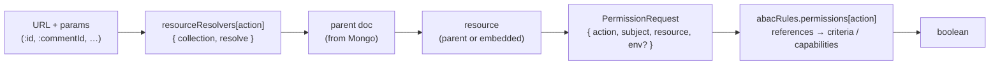
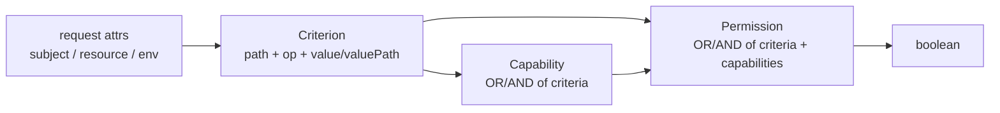
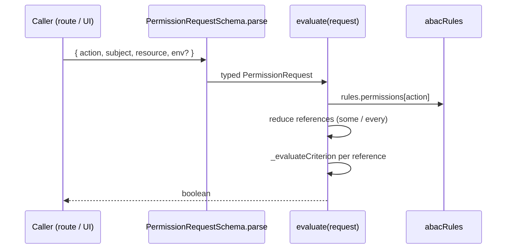

# ABAC: attribute-based access control

This document describes the shared permission system in `packages/shared`. Decisions are pure functions over a `request = { action, subject, resource, env }`. The same module is consumed identically by backend route middleware and by the frontend UI.

**Files:**

- [packages/shared/src/abac.service.ts](../src/abac.service.ts) — engine, schemas, `defineAbacRules`, `createChecker`.
- [packages/shared/src/abac.ts](../src/abac.ts) — the project's rules, `PermissionRequestSchema`, `checkPermission`, `resourceResolvers`.

---

## Principles

1. The [**Permission Request**](#1-the-permission-request--what-action-by-whom-on-what) - An object which describes *Who* wants to perform *Which* action on *What* entity. Optionally, another property can describe environment related conditions such as time of day or locale.
1. **Attributes, not roles.** Granting or denying permission is computed from attributes on the request object (`subject.role`, `resource.owner._id`, `env.hour`, …) rather than from a static role-to-permission map. Roles are just one possible attribute.
1. **The rules object** - A single object which defines
	The Rules: what is *required* in order for the system to grant permission to perform an action.
	How can the requirements defined by a given rule be *evaluated*.
1. **Schema is the source of truth.** Zod schemas in `abac.service.ts` validate the rules object at module load and define the runtime contract. The `defineAbacRules` helper layers literal-precise generics on top so typos in references fail at compile time.
1. **Shared across front and back.** Backend uses `checkPermission` inside route middleware; frontend uses it directly to gate UI affordances. Same rules, same evaluator, same decisions.

---

## The three parts

A permission decision involves three artifacts:

### 1. The permission request — *What action, by Whom, on What*

An `{ action, subject, resource, env? }` object. for example:

```ts
checkPermission({
	action: 'car:delete',
	subject: { _id: 'u1', fullname: 'Sharon', role: 'User' },
	resource: car,   // car.owner._id === 'u1' → isOwner holds → canWrite holds → true
})
```

- **`action`** — The 'What' or 'Intent' (*delete* a car). A string literal, functions as a unique identifier for the requested action.
- **`subject`** — The 'Who' (the loggedin user). In this codebase it is always the user who is attemting to perform the action, but could be a Worker Id or a script.
- **`resource`** — The 'Target' (the entity, a car in this example, to be acted on). 
- **`env`** — optional free-form record of environmental attributes (`{ hour, dow, … }`).

The request is processed by reading the rules object (see next section)

### 2. The rules object — *what makes an action allowed*

A permission rule defines a mapping between a request (i.e. delete a car) and one or more criteria (the requesting user is either an admin or the car's owner) which must be met for the request to be approved by the permission system. 

It is expressed by single declarative object with three sub-maps (see the example code bellow):

- **`criteria`** — atomic tests. Each entry has a `path` (where to read on the request), an `operator`, and either a literal `value` or a second `valuePath` (when comparing two attributes of the same request).
- **`capabilities`** — reusable groups of criteria bundled together to form a composite criterion. Each entry has an optional `operator` (`'or'` / `'and'`, default  === `'and'`) and a `references` array of criterion keys. Capabilities exist solely as a critria reuse mechanism which allows bundling several criteria into a composite so rules can reference `canWrite` (the capability bundle) instead of specifying `isAdmin`, `isOwner`, etc... 
- **`permissions`** — named decisions, keyed `'<resource>:<action>'`. Each entry has an optional `operator` (defaulting to `'and'` again) and a `references` array of namespaced keys (`criteria.<K>` or `capabilities.<K>`).

The rules object checks a request's **attribute paths** against literal values (see `isAdmin` bellow) or against other attribute paths of the request (see `isOwner`). It is built by passing an object such as the one bellow to the  `defineAbacRules` helper in [packages/shared/src/abac.ts](../src/abac.ts) (The helper simply stabalizes typing. The entire permission policies are embodied in the object itself)
Here is an example:

```ts
{
	criteria: {
		isAdmin: { path: 'subject.role',        operator: 'eq', value: 'Admin' },
		isOwner: { path: 'resource.owner._id',  operator: 'eq', valuePath: 'subject._id' },
		isMfa:   { path: 'subject.mfaVerified', operator: 'eq', value: true },
	},
	capabilities: {
		canWrite: { operator: 'or', references: ['isAdmin', 'isOwner'] },
	},
	permissions: {
		'car:delete': { references: ['capabilities.canWrite'] },
		'car:edit':   { references: ['capabilities.canWrite', 'criteria.isMfa'] }, // Implicit AND
	},
}
```

### 3. The `requirePermission()` middleware and `resourceResolvers` — (backend-only)

Backend routes start from an `:id` in the URL, not an instantiated resource. So for the middleware to be able to perform any request evaluation it first needs to fetch the resource <sup><a href="#fn-t">(1)</a></sup>. The action's resource is commonly a document from a collection but it can also be an embedded document in an array inside the main (parent) doc, or data from another collection.  
By defualt the resource is a document from the collection named by the first part of the action (`'car:update'` → `'car'`). If however, we need to evaluate aginst data from an array of sub documents (i.e. comments, likes, etc..) or from an entirely different collection, we can resolve the resource using a `resourceResolver` which is only listed when the evaluated resource diverges from the defaults.

`resourceResolvers[action]` is an entry of shape `{ collection?, resolve? }`. 

- **`collection`** — Mongo collection to fetch the parent doc from. Default: the prefix before `:` in the action key (`'car:update'` → `'car'`).
- **`resolve(parent, params)`** — derives the resource from the parent doc and the route params. The default is always resource === parent doc.

```ts
// 'car:deleteComment' fetches a Car, then digs out the comment by id.
resourceResolvers = {
	'car:deleteComment': {
		resolve: (car, params) => car.comments?.find(c => c.id === params.commentId),
	},
}
```

<sup><a href="#fn-t">(1)</a></sup> Fetching the resource from the DB to perform permission checks may seem expensive... for example - if i want to delete a resource, instead of issuing a single request to the DB, an additional preliminary request needs to be made. But fetching using the primary key is about 1-2ms in MongoDB (plus the network round trip if the DB is hosted elsewhere) which is neglegable and even more so if caching is implemented

### How they meet




Key connections to keep in mind while reading the rest of this doc:

- **`action`** is the only shared key across the three parts. It indexes the rules entry, selects the permission request variant, and (on the backend) selects the resource-resolver entry.
- **The rules object never reads URLs, params, or Mongo.** It only reads paths off the request. Anything outside the request — fetching the parent doc, traversing into embedded fields — is the resolver's job.
- **The request's `resource` schema is what makes the rule's paths meaningful.** A rule that reads `resource.owner._id` is only correct because `PermissionRequestSchema` ties that action to a resource schema (e.g. `CarSchema`) that has `owner._id`. Adding a rule and changing the resource schema must happen together.
- **The frontend skips the resolver step.** It already holds the resource (a `Car` from a list, a `Review` in the UI) and constructs the request directly. The resolver exists because the backend starts from a URL, not from an istantiated object.

---

## Building blocks

### Criterion

An atomic test on one attribute of the request.

```ts
{
	path: string,          // e.g. 'subject.role', 'resource.owner._id'
	operator: 'eq' | 'neq' | 'gt' | 'gte' | 'lt' | 'lte' |
	          'in' | 'nin' | 'between' | 'notBetween',

	// right-hand side: either a literal value...
	value: unknown,
	// ...or a second path into the same request:
	valuePath: string,
}
```

- `path` is a dotted lookup against the request (`subject.*`, `resource.*`, `env.*`).
- `value` is a literal compared with the attribute.
- `valuePath` is used when the right-hand side is another attribute of the request — for example, `resource.owner._id == subject._id` for ownership checks. Order matters in the union: `valuePath` is tried before `value`.
- Operator/value compatibility is enforced at evaluation time: `gt`/`gte`/`lt`/`lte` require a numeric attribute, `between`/`notBetween` require a numeric attribute plus a `[low, high]` tuple, `in`/`nin` require an array value.

### Capability

A named, reusable OR/AND group of criterion references.

```ts
{
	operator?: 'or' | 'and',   // default 'and'
	references: string[],      // criterion keys
}
```

A capability is just a bundle. It exists so that several permissions can share the same composition without duplicating it — e.g. `canWrite = isAdmin OR isModerator OR isOwner`.

### Permission

A keyed decision, named `'<resource>:<action>'`.

```ts
{
	operator?: 'or' | 'and',   // default 'and'
	references: (`criteria.${string}` | `capabilities.${string}`)[],
}
```

A permission composes criteria and capabilities with OR/AND. References are namespaced (`criteria.isAdmin`, `capabilities.canWrite`) so the evaluator knows which table to look up.

### Composition




---

## The rules object

Defined in [packages/shared/src/abac.ts](../src/abac.ts) via `defineAbacRules({ criteria, capabilities, permissions })`.

### Criteria


| Key               | Test                                              |
| ----------------- | ------------------------------------------------- |
| `isAdmin`         | `subject.role === 'Admin'`                        |
| `isModerator`     | `subject.role === 'Moderator'`                    |
| `isOwner`         | `resource.owner._id === subject._id` (valuePath)  |
| `isCommentAuthor` | `resource.author._id === subject._id` (valuePath) |
| `isReviewAuthor`  | `resource.byUser._id === subject._id` (valuePath) |
| `isMfa`           | `subject.mfaVerified === true`                    |
| `isOfficeHours`   | `env.hour` between `[9, 17]`                      |
| `isWeekend`       | `env.dow` in `['sat', 'sun']`                     |


Note: `env.hour` / `env.dow` are illustrative — nothing in the codebase populates `env` today. The criteria stand as examples of environmental attributes.

### Capabilities


| Key        | Composition                         |
| ---------- | ----------------------------------- |
| `canWrite` | `isAdmin OR isModerator OR isOwner` |


### Permissions


| Key                 | Composition                                 |
| ------------------- | ------------------------------------------- |
| `car:update`        | `isAdmin OR isModerator OR isOwner`         |
| `car:delete`        | `canWrite` (single capability reference)    |
| `car:deleteComment` | `isAdmin OR isModerator OR isCommentAuthor` |
| `review:delete`     | `isAdmin OR isModerator OR isReviewAuthor`  |


`car:delete` is the only permission that delegates to a capability. The others reference criteria directly because their compositions are not (yet) shared.

### Permission request shape

`PermissionRequestSchema` is a `z.discriminatedUnion('action', [...])`. Each variant pins an action to the resource schema the rule paths expect:


| `action`              | `subject`        | `resource`      |
| --------------------- | ---------------- | --------------- |
| `'car:update'`        | `MiniUserSchema` | `CarSchema`     |
| `'car:delete'`        | `MiniUserSchema` | `CarSchema`     |
| `'car:deleteComment'` | `MiniUserSchema` | `CommentSchema` |
| `'review:delete'`     | `MiniUserSchema` | `ReviewSchema`  |


`env` is `z.record(z.string(), z.unknown()).optional()` for every variant.

### Exhaustiveness check

```ts
type _PermissionKey = keyof typeof abacRules.permissions
type _Missing = Exclude<_PermissionKey, PermissionRequest['action']>
type _Exhaustive = [_Missing] extends [never]
	? true
	: `Missing variant for: ${_Missing & string}`

true satisfies _Exhaustive
```

If a permission is added to `abacRules.permissions` without a matching variant in `PermissionRequestSchema`, `_Exhaustive` becomes an error string such as `Missing variant for: car:archive` and the `true satisfies _Exhaustive` line fails to compile. This is the feedback loop that keeps the rules table and the request schema in sync.

### Resource resolvers

```ts
export type ResourceResolver = {
	collection?: string,
	resolve?: (parent: any, params: any) => unknown,
}
```

`resourceResolvers: Partial<Record<PermissionKey, ResourceResolver>>` is a small override table consumed by the backend `requirePermission` middleware. It exists because the backend starts from a URL, not from an instantiated resource — see [The three parts → How they meet](#how-they-meet). Defaults:

- `collection` = the prefix before `:` in the action key (`'car:update'` → `'car'`).
- `resolve` = identity (resource is the parent document).

Override an entry only when the resource diverges from those defaults, e.g. `car:deleteComment` reads a comment embedded inside a `Car`:

```ts
'car:deleteComment': {
	resolve: (car, params) => car.comments?.find(c => c.id === params.commentId),
},
```

The schema of the resource this resolver produces must match the `resource` schema pinned to the same `action` in `PermissionRequestSchema` — that's the type-level link between the two parts. For `car:deleteComment` the resolver returns a `Comment` because the request variant for that action declares `resource: CommentSchema`.

---

## ABAC rules utility: `defineAbacRules`

```ts
defineAbacRules<TCriteria, TCapability, TPermission>(rules)
```

**Runtime:** identity-with-validation. It calls `AbacRulesSchema.parse(rules)` (throws on a malformed structure) and returns `rules` typed as the input — preserving the precise literal types of every key.

**Compile time:** this is where the value is. The generic constraints force:

- Every `capabilities[*].references` entry to be a key of `TCriteria`.
- Every `permissions[*].references` entry to match the template-literal union `criteria.{name}` or `capabilities.{name}` (enforced by `defineAbacRules` generics).

**Why it's needed:**

1. References are strings. Without these constraints, a typo like `'criteria.isAdmn'` or `'capabilities.canWriet'` would only surface at evaluation time (when the engine tries to look up the missing key) or worse, silently fail.
2. The returned object has a precise type whose `keyof permissions` becomes `PermissionKey`. That type powers the exhaustiveness check above and the `action` discriminator on `PermissionRequestSchema`.
3. It's the natural place to enforce the layering rule (capabilities → criteria only; permissions → criteria or capabilities) in the type system, since the runtime schema cannot express cross-key references.

---

## `createChecker` utility

```ts
const evaluate = createChecker(abacRules)
export const checkPermission = (request: PermissionRequest) => evaluate(request)
```

`createChecker(rules)` returns a closure `evaluate(request) -> boolean` that holds a reference to the (already validated) rules object. The exported `checkPermission` is a thin wrapper so consumers never see the rules.

### Algorithm

```ts
function evaluate(request) {
	const { action } = request
	const policy = rules.permissions[action]
	if (!policy) throw new Error('Policy for ' + action + ' not found')

	const method = (policy.operator === 'or') ? 'some' : 'every'

	return policy.references[method] (reference => {
		const [type, key] = reference.split('.')

		if (type === 'criteria') return _evaluateCriterion(request, rules.criteria[key])

		const capability = rules.capabilities[key]
		const capMethod = (capability.operator === 'or') ? 'some' : 'every'

		return capability.references[capMethod] (criterionKey =>
			_evaluateCriterion(request, rules.criteria[criterionKey]))
	})
}
```

Step by step:

1. Look up `policy = rules.permissions[action]`. Throw if the action is unknown.
2. Pick the reducer: `Array.prototype.some` when `operator === 'or'`, otherwise `every`. AND is the default when `operator` is omitted.
3. For each reference:
  `criteria.{key}` — evaluate that criterion directly.
   `capabilities.{key}` — reduce the capability's own references with its own `some`/`every` choice, evaluating each as a criterion.
4. Criterion evaluation (`_evaluateCriterion`):
  `attr = _getValueByPath(request, criterion.path)` — dotted lookup against the request.
   `value = ('valuePath' in criterion) ? _getValueByPath(request, criterion.valuePath) : criterion.value`.
   `_performCheck(attr, operator, value)` runs the operator with runtime guards (numeric ops require a numeric attribute; `in`/`nin` require an array value; `between`/`notBetween` require both).

### Why a factory

- It closes over a single validated rules object so the rules aren't re-parsed on every check and consumers don't pass them around.
- The returned function is small and synchronous: trivially composable inside Express middleware or React render code.
- Decisions are O(criteria evaluated) with at most one level of indirection through a capability — the lack of recursion is intentional. Keep the rules object flat and the evaluator stays trivial to reason about.

---

## End-to-end request flow




### Consumers

- **Backend:** [apps/backend/src/middleware/require-permission.ts](../../../apps/backend/src/middleware/require-permission.ts) runs all three parts in order: looks up `resourceResolvers[action]` for `{ collection, resolve }` defaults, fetches the parent doc, calls `resolve` to derive the resource, parses with `PermissionRequestSchema`, then `checkPermission`. Throws `ForbidenError` if the result is `false`.
- **Frontend:** `CarList`, `CarDetails`, and `ReviewList` skip the resolver step — they already hold the resource — and call `checkPermission` directly with the logged-in user as `subject`.

---

## Adding a new permission

1. Add any new atomic tests to `criteria` (`path`, `operator`, `value` or `valuePath`).
2. *(Optional)* Add a `capabilities` entry if the same composition will be reused across permissions.
3. Add the `'<resource>:<action>'` entry to `permissions` with `operator` + `references`.
4. Add a matching variant to `PermissionRequestSchema`. The `resource` schema must contain every path the relevant criteria read.
5. If the resource is not the parent document of the action's prefix collection (or lives in a different collection), add a `resourceResolvers[action]` entry. Its return type must match the `resource` schema you declared in step 4.
6. `true satisfies _Exhaustive` will fail to compile until step 4 is done — that's the intended feedback loop.

---

## Quick reference


| I need to…                                          | Use                                                       |
| --------------------------------------------------- | --------------------------------------------------------- |
| Test one attribute against a value                  | A `criteria` entry with `path` + `operator` + `value`     |
| Test one attribute against another attribute        | A `criteria` entry with `path` + `operator` + `valuePath` |
| Reuse the same OR/AND group across permissions      | A `capabilities` entry                                    |
| Gate an action                                      | A `permissions` entry keyed `'<resource>:<action>'`       |
| Match an action to a resource shape                 | A variant in `PermissionRequestSchema`                    |
| Override how the resource is fetched on the backend | A `resourceResolvers[action]` entry                       |
| Decide a request                                    | `checkPermission(request)`                                |


