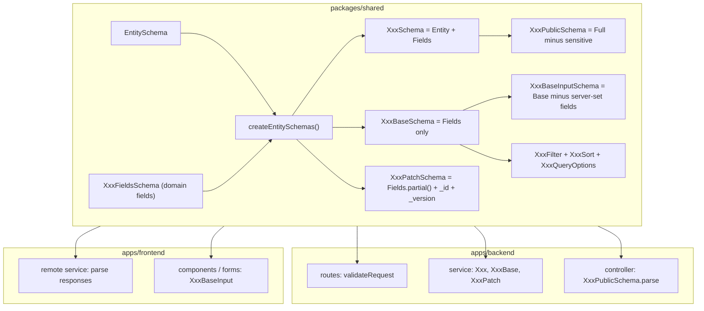
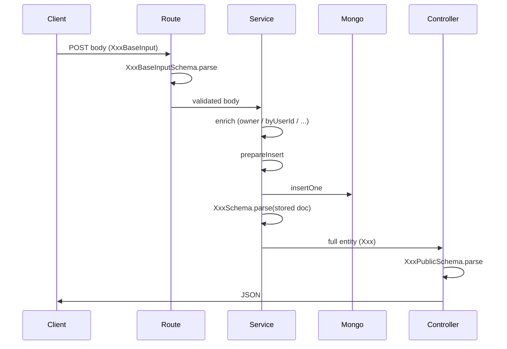
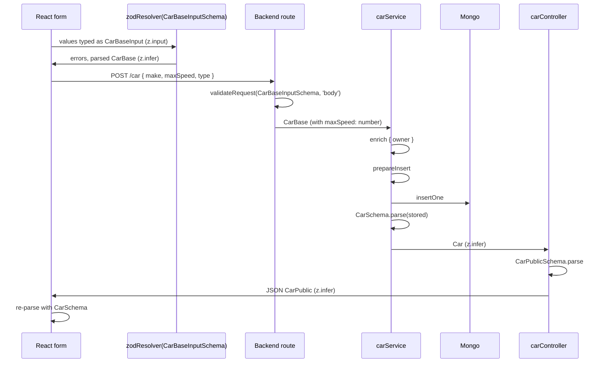

# Shared type system

This document describes how domain types are defined and used across the monorepo. **Car** and **Review** are the primary examples; **User** is covered briefly because it follows the same patterns and is the only entity that today demonstrates a real `*Public` redaction.

**Package:** `@cars/shared` (npm name). A TypeScript path alias `@car/shared` resolves to the same entry in `tsconfig.base.json` and is also in use in several backend files — `@cars/shared` is the canonical name; see [Known inconsistencies](#known-inconsistencies).

---

## Principles

1. **Zod is the single source of truth.** All schemas live in `packages/shared/src/`. TypeScript types are derived from those schemas with `z.infer` or `z.input` — never duplicated by hand.

2. **Schemas and types are exported together.** Every call site that needs `Car` also imports `CarSchema`, so runtime validation and compile-time typing stay aligned.

3. **Parse at every trust boundary.**
	- Express routes parse `body`, `query`, `params` via the `validateRequest` middleware.
	- The backend service layer re-parses documents read from MongoDB (turns `ObjectId` into `string`, dates into `Date`, etc.).
	- Controllers parse the response shape with `*PublicSchema` before sending JSON.
	- The frontend HTTP client parses every response.
	- Forms parse on submit through `zodResolver`.

4. **Layered shapes, not one mega-type.** The same logical entity has different schemas for storage, API input, API output, and list queries. The name encodes the role: `XxxBaseInputSchema` is *not* the same thing as `XxxSchema`.

---

## Architecture overview



**Intended layer usage:**

| Layer | Types |
|-------|--------|
| Mongo write / backend service | `Car`, `Review` (full entity after `XxxSchema.parse`) |
| HTTP response to clients | `CarPublic`, `ReviewPublic`, `AggregatedReview` |
| HTTP request bodies (create) | `CarBaseInput`, `ReviewBaseInput` |
| HTTP request bodies (update) | `CarPatch` (post-parse), `CarPatchInput` (pre-parse) |
| List queries from URL | `CarQueryOptionsInput` → parse → `CarQueryOptions` |

---

## Entity layer

All top-level persisted entities share metadata defined in [packages/shared/src/entity.ts](../src/entity.ts).

### `EntitySchema`

```ts
z.object({
	_id: EntityIdSchema,
	_createdAt: z.coerce.date(),
	_updatedAt: z.coerce.date(),
	_version: z.number().positive(),
})
```

`_version` is used for optimistic concurrency on patch. `_createdAt` / `_updatedAt` are stored as `Date` and coerced from strings/numbers on parse.

### `EntityIdSchema`

```ts
z.preprocess(val =>
	(val && typeof (val as any).toHexString === 'function') ? (val as any).toHexString() : val,
	z.string())
```

This duck-types MongoDB `ObjectId` (any object with a `toHexString` method) to a hex string. **Why duck-type:** the shared package does not depend on the `mongodb` driver, so a `BSON.ObjectId` instance can be parsed without importing the class. Strings pass through unchanged.

### `Entity` type

`export type Entity = z.infer<typeof EntitySchema>` — used generically wherever code only needs to know "this thing has `_id`". For example, `byObjectId<T extends Entity>(docOrId: T | string)` in [apps/backend/src/services/db.service.ts](../../../apps/backend/src/services/db.service.ts).

### Metadata semantics live in the backend

The schema declares the *shape* of the metadata; the *runtime behavior* lives in [apps/backend/src/services/db.service.ts](../../../apps/backend/src/services/db.service.ts):

- **`prepareInsert(doc)`** sets `_createdAt`, `_updatedAt`, `_version: 1` on create.
- **`prepareUpdate(doc)`** requires `_id`, optionally accepts `_version`, builds the Mongo filter (with the version check) and an update with `$set`, `$inc: { _version: 1 }`, `$currentDate: { _updatedAt: true }`.
- **`byObjectId(docOrId)`** turns a string or entity into `{ _id: new ObjectId(...) }`.

---

## `createEntitySchemas`

A helper in [packages/shared/src/entity.ts](../src/entity.ts) that standardizes how a new top-level entity is built from its domain fields:

```ts
export function createEntitySchemas<T extends z.ZodRawShape>(dataShape: z.ZodObject<T>) {
	const fullSchema = EntitySchema.extend(dataShape.shape)
	const baseSchema = dataShape // semantic alias: fields only
	const patchSchema = dataShape.partial().extend({
		_id: EntitySchema.shape._id,
		_version: EntitySchema.shape._version,
	})
	return { fullSchema, baseSchema, patchSchema }
}
```

Given `XxxFieldsSchema`:

| Returned key | Exported as | Type | Role |
|--------------|-------------|------|------|
| `fullSchema` | `XxxSchema` | `Xxx` | Stored document; canonical in-memory shape |
| `baseSchema` | `XxxBaseSchema` | `XxxBase` | Domain fields only, no entity metadata |
| `patchSchema` | `XxxPatchSchema` | `XxxPatch` / `XxxPatchInput` | All fields optional + required `_id` + required `_version` |

`baseSchema` is intentionally a *semantic alias* of `dataShape`. It is the same Zod object, just exported under a name that says "this is what a fresh document's domain payload looks like".

### Backend create / update / read flow



---

## Naming convention

For each domain entity `Xxx`:

| Schema | Type | Meaning |
|--------|------|---------|
| `XxxFieldsSchema` | — | Domain-only fields (no `_id`, dates, version). Input to `createEntitySchemas`. |
| `XxxSchema` | `Xxx` | Full persisted entity (`Entity + Fields`). |
| `XxxBaseSchema` | `XxxBase` | Domain payload after route validation (server-set fields already present). |
| `XxxBaseInputSchema` | `XxxBaseInput` | Client create body: `Base` minus fields the server fills in (e.g. `owner`, `byUserId`). |
| `XxxPatchSchema` | `XxxPatch` / `XxxPatchInput` | Partial fields + required `_id` + required `_version`. |
| `XxxPublicSchema` | `XxxPublic` | Safe wire format (omit / redact sensitive fields). |
| `XxxFilterSchema` | `XxxFilter` | List filter criteria. |
| `XxxSortFieldSchema` | `XxxSortField` | Allowed sort field names. |
| `XxxSortSchema` | `XxxSort` | `{ sortField, sortDir }`. |
| `XxxQueryOptionsSchema` | `XxxQueryOptions` / `XxxQueryOptionsInput` | `{ filterBy?, sortBy? }`. |
| `XxxParamsSchema` | `XxxParams` | Route params (e.g. `{ id }`). |

Type exports mirror schema names: `Car`, `CarBaseInput`, `CarPublic`, etc.

---

## Car (reference entity)

[packages/shared/src/car.ts](../src/car.ts).

### Fields (`CarFieldsSchema`)

- `make` (`string().min(1)`)
- `maxSpeed` (`z.coerce.number().positive()`)
- `type` (`CarTypeSchema` — enum of fuel/engine types)
- `owner` (`MiniUserSchema`)
- `comments?` (array of `CommentSchema`)
- `likedBy?` (array of `LikeSchema`)

### Variants

| Schema | Notes |
|--------|--------|
| `CarSchema` | Full car as stored. |
| `CarBaseSchema` | All domain fields, including `owner`. The body type after `validateRequest(CarBaseInputSchema, 'body')` is logically `CarBase` only once the service enriches it with the owner. |
| `CarBaseInputSchema` | `CarBaseSchema.omit({ owner: true })`. The client never sends `owner`; the server reads it from the auth session. |
| `CarPatchSchema` | All fields optional + required `_id` + required `_version`. |
| `CarPublicSchema` | `CarSchema.safeExtend({ comments: CommentPublic[], likedBy: LikePublic[] })`. Currently equivalent to `CarSchema` because neither nested schema redacts anything — the structure exists so future redaction does not require renaming consumers. |

### Where Car types are consumed

| Location | Schemas / types |
|----------|------------------|
| [apps/backend/src/api/car/car.routes.ts](../../../apps/backend/src/api/car/car.routes.ts) | Validates `CarQueryOptionsSchema`, `CarBaseInputSchema`, `CarPatchSchema`, `CommentInputSchema`, `CarParamsSchema`, `CommentParamsSchema` |
| [apps/backend/src/api/car/car.service.ts](../../../apps/backend/src/api/car/car.service.ts) | Works with `Car`, `CarBase`, `CarPatch`; parses Mongo reads with `CarSchema` |
| [apps/backend/src/api/car/car.controller.ts](../../../apps/backend/src/api/car/car.controller.ts) | Parses every response with `CarPublicSchema` / `CommentPublicSchema` |
| [apps/frontend/src/services/car/car.service.remote.ts](../../../apps/frontend/src/services/car/car.service.remote.ts) | Parses responses with `CarSchema` (see drift list), accepts `CarBaseInput \| CarPatchInput` |
| [apps/frontend/src/pages/CarEdit.tsx](../../../apps/frontend/src/pages/CarEdit.tsx) | `useForm<CarBaseInput>({ resolver: zodResolver(CarBaseInputSchema) })` |
| [apps/frontend/src/cmps/CarFilter.tsx](../../../apps/frontend/src/cmps/CarFilter.tsx) | Uses `CarQueryOptions`, `CarSortField`, `CarType`, iterates `CarTypeSchema.options` |

---

## Sub-entities (embedded documents)

`Comment` and `Like` live *inside* a `Car` document; they are not their own collections. Sub-entities deliberately bypass `createEntitySchemas`:

- They have no `_createdAt` / `_updatedAt` / `_version` — Comment uses a string `id` field generated by `makeId()`, and a numeric `createdAt` timestamp.
- They are addressed through the parent's route: `/car/:id/comment/:commentId`.

| Schema | Type | Role |
|--------|------|------|
| `CommentSchema` | `Comment` | Stored comment: `{ id, createdAt, txt, author }` |
| `CommentPublicSchema` | `CommentPublic` | Wire shape (alias of full today) |
| `CommentInputSchema` | `CommentInput` | POST body: `{ txt }` only |
| `CommentParamsSchema` | `CommentParams` | `{ id, commentId }` for the nested route |
| `LikeSchema` | `Like` | `{ createdAt, by }` |
| `LikePublicSchema` | `LikePublic` | Wire shape (alias of full today) |

`Like` has no `InputSchema` because the client never sends a `Like` body — the backend builds it from the authenticated user when the like endpoint is hit. Add `LikeInputSchema` if a client-supplied payload appears.

---

## Review and `AggregatedReview`

[packages/shared/src/review.ts](../src/review.ts). Review uses the same variant set as Car (Base, BaseInput, Patch, Public, Filter, Sort, QueryOptions, Params) but additionally introduces a **view / aggregation DTO**.

### Fields (`ReviewFieldsSchema`)

- `byUserId` (`EntityIdSchema`)
- `aboutCarId` (`EntityIdSchema`)
- `txt` (`string`)
- `rating` (`number().min(1).max(5)`)

### View type: `AggregatedReviewSchema`

```ts
ReviewSchema
	.omit({ byUserId: true, aboutCarId: true })
	.extend({
		aboutCar: CarSchema.omit({ ... }).extend({ owner: MiniUser.omit({ role: true }) }).optional(),
		byUser: MiniUserSchema.omit({ role: true }).optional(),
	})
```

`AggregatedReview` is not a third persistence shape. It describes the result of the `$lookup` pipeline in [apps/backend/src/api/review/review.service.ts](../../../apps/backend/src/api/review/review.service.ts): the foreign-key ids are stripped and replaced with inlined joined objects. Two consequences worth flagging:

1. **`AggregatedReviewSchema` is not built with `createEntitySchemas`.** View types are always hand-derived with `omit` / `pick` / `extend` from existing entity schemas. Document which endpoints emit them.
2. **Sort fields can refer to joined paths.** `ReviewSortFieldSchema` includes `'fullname'`, `'make'`, `'maxSpeed'`; the service maps these to dotted Mongo keys like `'byUser.fullname'`.

### Routes that emit each shape

| Endpoint | Response shape |
|----------|----------------|
| `GET /review` | `AggregatedReview[]` |
| `GET /review/:id` | `Review` (no joins) — parsed with `ReviewPublicSchema` |
| `POST /review` | `AggregatedReview` |
| `PATCH /review/:id` | `Review` — parsed with `ReviewPublicSchema` |
| `DELETE /review/:id` | 204 |

**Client rule of thumb:** prefer `AggregatedReview` whenever the UI needs joined data; use `Review` when only ids and scalars are required.

---

## User (brief)

[packages/shared/src/user.ts](../src/user.ts) uses exactly the same pattern. Two things worth noting:

- **`UserPublicSchema = UserSchema.omit({ password: true })`** — the only place in the codebase where `*Public` performs a *real* redaction today.
- **`MiniUserSchema`** is `UserSchema.pick({ _id, fullname, imgUrl, role })` and is embedded inside `CarSchema.owner`, `CommentSchema.author`, `LikeSchema.by`, and the joined `AggregatedReview.byUser` (with `role` further omitted on the joined version).

For signup/login, `User` defines two pick'd schemas (`SignupCredentialsSchema`, `LoginCredentialsSchema`) instead of going through the generic `BaseInput` pattern, because the fields don't match the domain payload one-for-one.

---

## Filter, Sort and `QueryOptions`

Every list-capable entity exposes the same trio:

```ts
XxxFilterSchema       // optional filter fields, often with z.coerce for numbers
XxxSortFieldSchema    // z.enum([...]).optional()
XxxSortSchema         // { sortField, sortDir }
XxxQueryOptionsSchema // { filterBy?, sortBy? }
```

### Semantics

- **Filter** fields are ANDed together by the backend's `_parseQueryOptions` when building the Mongo `criteria`.
- **`sortDir`** is `1` (ascending) or `-1` (descending). Its preprocess (`Number(val) || 1`) accepts the string forms that Express delivers from query strings (`"1"`, `"-1"`).
- **`QueryOptions`** is the wrapper used on `GET` URLs; route middleware parses it once before the controller runs.

### Backend mapping (Car)

| Filter field | Mongo criteria |
|--------------|----------------|
| `txt` | `make` regex, case-insensitive |
| `minSpeed` | `maxSpeed: { $gte }` |
| `type` | equality on `type` |

Review additionally converts `aboutCarId` / `byUserId` strings to `ObjectId` and runs through the aggregation pipeline.

### Where they are used in the UI

[apps/frontend/src/cmps/CarFilter.tsx](../../../apps/frontend/src/cmps/CarFilter.tsx) and [apps/frontend/src/cmps/ReviewFilter.tsx](../../../apps/frontend/src/cmps/ReviewFilter.tsx) hold the editable `CarQueryOptions` / `ReviewQueryOptions` in component state and call `setQueryOptions` upward. The list page (`CarIndex` / `ReviewIndex`) calls the remote service with that object; the remote service runs `XxxQueryOptionsSchema.parse` before serializing to URL.

---

## `z.infer` vs `z.input`

This is the conceptual core of the type system, so it deserves its own section.

### Mental model

A Zod schema is a **function**: raw value in → validated value out. The two utilities answer the two sides:

| Utility | Question it answers |
|---------|---------------------|
| `z.input<typeof S>` | What may I pass **into** `S.parse(x)`? |
| `z.infer<typeof S>` | What type do I have **after** `S.parse(x)`? |

For schemas with no coercion, preprocessing, transforms, or defaults, the two types are identical. They start to diverge as soon as Zod has to *change* the value during parsing.

### Where they diverge in this codebase

| Schema or field | Input (looser) | Output (`infer`) |
|------------------|----------------|------------------|
| `z.coerce.number()` (e.g. `Car.maxSpeed`, `CarFilter.minSpeed`) | `string \| number \| boolean \| ...` | `number` |
| `z.coerce.date()` (`_createdAt`, `_updatedAt`) | `string \| number \| Date \| ...` | `Date` |
| `EntityIdSchema` preprocess | `unknown` (any ObjectId-like or string) | `string` |
| `sortDir` preprocess | `unknown` (typically `"1"` or `"-1"` from URL) | `1 \| -1` |

**Concrete example:** `?minSpeed=100` arrives at the backend as `"100"`. `z.input<typeof CarFilterSchema>` allows that. After parse, `CarFilter` has `minSpeed?: number`. The same divergence shows up on the client in `CarEdit.tsx`: `<input type="number">` produces a string until `zodResolver(CarBaseInputSchema)` coerces it.

### Rule for which to export

```
*Input suffix or pre-parse caller data  →  z.input<typeof XxxSchema>
Validated / stored / API-out data       →  z.infer<typeof XxxSchema>
```

| Export | Recommended utility |
|--------|---------------------|
| `Entity`, `Car`, `Review`, `User`, `MiniUser`, `Comment`, `Like` | `z.infer` |
| `CarPublic`, `ReviewPublic`, `CommentPublic`, `LikePublic`, `UserPublic`, `AggregatedReview` | `z.infer` |
| `CarBase`, `ReviewBase` (post-route, already parsed) | `z.infer` |
| `CarBaseInput`, `CarPatchInput`, `ReviewBaseInput`, `ReviewPatchInput`, `CommentInput`, `UserBaseInput` | `z.input` |
| `CarFilter`, `CarSort`, `CarQueryOptions` (services receive parsed objects) | `z.infer` |
| `CarQueryOptionsInput`, `UserQueryOptionsInput` (forms / URL builders) | `z.input` |

Even when `infer` and `input` produce identical types today, prefer `z.input` on `*Input` exports: it documents intent and survives future `z.coerce` / preprocess additions without changing call sites.

### End-to-end example: creating a Car



In code:

- `useForm<CarBaseInput>({ resolver: zodResolver(CarBaseInputSchema) })` — form values are the `z.input` shape (`maxSpeed` may be string from `<input type="number">` until the resolver coerces it).
- `save(car: CarPatchInput | CarBaseInput): Promise<Car>` — argument is the loose pre-parse shape; return is the validated entity.

---

## Consumption map

### Car

| Location | Schemas / types |
|----------|-----------------|
| [car.routes.ts](../../../apps/backend/src/api/car/car.routes.ts) | `CarQueryOptionsSchema`, `CarBaseInputSchema`, `CarPatchSchema`, `CarParamsSchema`, `CommentInputSchema`, `CommentParamsSchema` |
| [car.service.ts](../../../apps/backend/src/api/car/car.service.ts) | Types: `Car`, `CarBase`, `CarPatch`, `CarQueryOptions`, `Comment`. Parses with `CarSchema`, `CommentSchema`. |
| [car.controller.ts](../../../apps/backend/src/api/car/car.controller.ts) | Types: `CarPublic`, `CarBase`, `CarPatch`, `CarQueryOptions`, `CarParams`, `Comment`, `CommentInput`, `CommentParams`. Responds with `CarPublicSchema.parse`, `CommentPublicSchema.parse`. |
| [car.service.remote.ts](../../../apps/frontend/src/services/car/car.service.remote.ts) | Parses with `CarSchema`, `CarPatchSchema`, `CarBaseInputSchema`, `CarQueryOptionsSchema`, `CommentSchema`. |
| [car.service.local.ts](../../../apps/frontend/src/services/car/car.service.local.ts) | Uses `CarPublicSchema`. |
| [CarEdit.tsx](../../../apps/frontend/src/pages/CarEdit.tsx) | `CarBaseInputSchema`, `CarBaseInput`, `CarTypeSchema`. |
| [CarFilter.tsx](../../../apps/frontend/src/cmps/CarFilter.tsx) | `CarQueryOptions`, `CarSortField`, `CarType`, `CarTypeSchema.options`. |

### Review

| Location | Schemas / types |
|----------|-----------------|
| [review.routes.ts](../../../apps/backend/src/api/review/review.routes.ts) | `ReviewQueryOptionsSchema`, `ReviewBaseInputSchema`, `ReviewPatchSchema`, `ReviewParamsSchema` |
| [review.service.ts](../../../apps/backend/src/api/review/review.service.ts) | Types: `Review`, `ReviewBase`, `ReviewBaseInput`, `ReviewPatch`, `ReviewQueryOptions`, `AggregatedReview`, `MiniUser`. Parses with `ReviewSchema`, `AggregatedReviewSchema`. |
| [review.controller.ts](../../../apps/backend/src/api/review/review.controller.ts) | Parses with `ReviewPublicSchema`, `AggregatedReviewPublicSchema`. |
| [review.service.remote.ts](../../../apps/frontend/src/services/review/review.service.remote.ts) | Parses with `AggregatedReviewSchema`, `ReviewPublicSchema`, `ReviewPatchSchema`, `ReviewBaseInputSchema`, `ReviewQueryOptionsSchema`. |
| [ReviewFilter.tsx](../../../apps/frontend/src/cmps/ReviewFilter.tsx) | `ReviewQueryOptions`, `ReviewSort['sortField']`. |

---

## Known inconsistencies

Documented as-is. Each item is a real divergence found while reviewing the current code; fix them in dedicated PRs.

1. **`*BaseInput` convention drift.** `CarBaseInput = z.input<typeof CarBaseInputSchema>` follows the rule; `ReviewBaseInput = z.infer<typeof ReviewBaseInputSchema>` and `CommentInput = z.infer<typeof CommentInputSchema>` do not. No runtime difference today, but it breaks the rule and will hide bugs the moment `z.coerce` shows up in those schemas.

2. **Type lies in `review.service.remote.ts`.** [review.service.remote.ts](../../../apps/frontend/src/services/review/review.service.remote.ts) types `query()` as `Promise<ReviewPublic[]>` but actually parses with `AggregatedReviewSchema.array()`. The return value is `AggregatedReview[]`.

3. **Runtime crash risk in `reviewService.patch`.** `ReviewPatchSchema` makes all domain fields optional (because of `dataShape.partial()`), but [review.service.ts](../../../apps/backend/src/api/review/review.service.ts) does `new ObjectId(reviewPatch.aboutCarId)` unconditionally. A patch that does not include `aboutCarId` will throw inside `new ObjectId(undefined)`.

4. **`_version` contract mismatch.** `XxxPatchSchema` makes `_version` required (taken from `EntitySchema.shape._version` which is `z.number().positive()`), but `prepareUpdate` in [db.service.ts](../../../apps/backend/src/services/db.service.ts) types it as `_version?: number` and only includes it in the criteria when present. Pick one: either make `_version` optional in the patch schema (then the contract is "best-effort optimistic concurrency"), or remove the conditional in `prepareUpdate` (then patches without `_version` legitimately fail).

5. **`*Public` is a no-op alias for everything except User.** `CarPublicSchema`, `ReviewPublicSchema`, `CommentPublicSchema`, `LikePublicSchema`, `AggregatedReviewPublicSchema` are structurally identical to their non-public counterparts. They exist so that consumers can keep using `XxxPublic` once redaction is introduced — but right now nothing is hidden. Worth a comment in each schema saying "intentionally no-op until X".

6. **`CarTypeSchema` placeholder preprocess.** `z.preprocess(val => val, CarTypeSchema)` is a no-op — either remove the preprocess wrapper or implement a real transform.

7. **Import alias drift.** Both `@cars/shared` (used by the frontend and `car.service.ts`) and `@car/shared` (used by `car.controller.ts`, `car.routes.ts`, `review.controller.ts`, `review.routes.ts`, `review.service.ts`, `abac.ts`) resolve to the same package via `tsconfig.base.json`. Pick `@cars/shared` (the npm name) as canonical and migrate the rest.

8. **Frontend Car parses with `CarSchema`, not `CarPublicSchema`.** [car.service.remote.ts](../../../apps/frontend/src/services/car/car.service.remote.ts) calls `CarSchema.parse(data)` on the response. By convention API clients should consume `*Public` so a future redaction does not silently fail validation on the wire-narrow shape.

9. **MongoCar typing inconsistency.** `MongoCar = Omit<Car, '_id'>` in [car.service.ts](../../../apps/backend/src/api/car/car.service.ts) loses `_id` from the type altogether. `MongoReview` in [review.service.ts](../../../apps/backend/src/api/review/review.service.ts) refines `_id` (and `byUserId`, `aboutCarId`) to `ObjectId`. Pick one approach.

---

## Adding a new top-level entity

1. Define `XxxFieldsSchema` (domain fields only).
2. `const { fullSchema, baseSchema, patchSchema } = createEntitySchemas(XxxFieldsSchema)`.
3. Export `XxxSchema`, `XxxBaseSchema`, `XxxPatchSchema`.
4. Define `XxxBaseInputSchema = baseSchema.omit({ ...serverSetFields })`.
5. Define `XxxPublicSchema = fullSchema.omit({ ...sensitive })` (or just `= fullSchema` if nothing is hidden yet — keep the alias for future-proofing).
6. Define `XxxFilterSchema`, `XxxSortFieldSchema`, `XxxSortSchema`, `XxxQueryOptionsSchema`.
7. Define `XxxParamsSchema` if the entity has a REST route.
8. Export types: `z.infer` for entity/Public/Filter/Sort/QueryOptions; `z.input` for every `*Input` and `*QueryOptionsInput`.
9. Wire backend: routes → `validateRequest` → service (`XxxSchema.parse` after Mongo reads, `prepareInsert` / `prepareUpdate` for writes) → controller (`XxxPublicSchema.parse` before `res.json`).
10. Wire frontend: remote service parses responses with `XxxPublicSchema` (or the view schema), accepts `XxxBaseInput | XxxPatchInput` for save.

For embedded sub-documents: define `YySchema`, optional `YyPublicSchema` / `YyInputSchema` / `YyParamsSchema`; nest under the parent's `FieldsSchema`. Do **not** route them through `createEntitySchemas`.

---

## Related modules

| Module | Role |
|--------|------|
| [http.ts](../src/http.ts) | `HttpCodes` constant + `HttpCode` union; `ErrorCode` union; `ApiErrorResponse` interface returned by the error-handling middleware. |
| [abac.ts](../src/abac.ts) | Permission resource shapes are typed against existing entity schemas: `PermissionRequestSchema` uses `MiniUserSchema` for `subject` and `CarSchema` / `CommentSchema` / `ReviewSchema` for `resource`. Worth noting that ABAC for `review:delete` checks `resource.byUser._id` — i.e. it expects an `AggregatedReview`-shaped resource, not a plain `Review`. |

---

## Quick reference

| I need… | Use |
|---------|-----|
| Type after a DB read | `z.infer<typeof XxxSchema>` → `Xxx` |
| Type for a form / POST body before parse | `z.input<typeof XxxBaseInputSchema>` → `XxxBaseInput` |
| Type for API JSON sent to the browser | `XxxPublic` (or `AggregatedReview` for joined lists) |
| Validate an incoming request | `validateRequest(XxxBaseInputSchema, 'body')` (or `'query'`, `'params'`) |
| Validate an outgoing response | `XxxPublicSchema.parse` (or `AggregatedReviewPublicSchema.parse`) |
| Build list filters from a query string | `XxxQueryOptionsSchema.parse` → `XxxQueryOptions` |
| Reference any entity generically | `Entity` (anything with `_id`) |
| Convert string ↔ ObjectId at the DB boundary | `byObjectId` ([db.service.ts](../../../apps/backend/src/services/db.service.ts)) |
