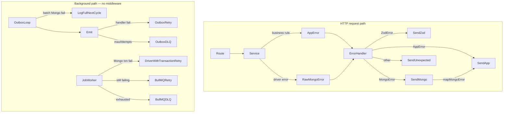

# Plan 001 — Mongo & Queue Error Handling

## Goal

Introduce consistent, layered error handling for MongoDB operations and the queue stack (`outbox`, `event-bus`, `job-queue`, `queues.config`) that aligns with the existing `AppError` hierarchy and Express `errorHandler` middleware — without duplicating domain logic already expressed in services.

---

## Current State

### HTTP error pipeline (keep and extend)


| Layer                                                                                             | Role today                                                                                                  |
| ------------------------------------------------------------------------------------------------- | ----------------------------------------------------------------------------------------------------------- |
| `[packages/shared/src/http.ts](../packages/shared/src/http.ts)`                                   | `HttpCodes`, `ErrorCode`, `ApiErrorResponse` contract                                                       |
| `[apps/backend/src/errors/app-errors.ts](../apps/backend/src/errors/app-errors.ts)`               | Domain errors (`EntityNotFoundError`, `ConflictError`, …) + `InternalServerError` / `UnexpectedServerError` |
| `[apps/backend/src/middleware/error-handler.ts](../apps/backend/src/middleware/error-handler.ts)` | Maps `ZodError` → 422, `AppError` → typed response, everything else → 500 `INTERNAL_ERROR`                  |


Express 5 propagates rejected async route handlers to `errorHandler` automatically — no wrapper needed.

### Mongo usage today

`[db.service.ts](../apps/backend/src/services/db.service.ts)` connects at module load, logs connection/collection failures, and rethrows raw driver errors. Services translate **business outcomes** (e.g. `modifiedCount === 0`) into `AppError`, but **driver errors** (duplicate key, network timeout, transaction abort) bubble up unmapped → HTTP clients always get generic 500.

Transactions appear in:

- `car.service.addComment` — outbox insert + car update in one session
- `job-queue._runHandler` — handler + completedJobs insert in one session

### Queue stack today

```
HTTP service ──registerTask──▶ outbox (Mongo) ──dispatchLoop──▶ event-bus ──emit──▶ job-queue (BullMQ + Mongo idempotency)
```


| Module                                                            | Error behavior today                                                                                                                                                          | Gaps                                                                                                                                       |
| ----------------------------------------------------------------- | ----------------------------------------------------------------------------------------------------------------------------------------------------------------------------- | ------------------------------------------------------------------------------------------------------------------------------------------ |
| `[outbox.ts](../apps/backend/src/services/queue/outbox.ts)`       | Per-task emit failures → retry up to `maxAttempts`, then `FAILED` + `errorReason`; dispatch loop outer catch → `console.error` only (errors swallowed without structured log) | Batch-level Mongo failures need full `logger.error`; no app-level Mongo retry — next dispatch cycle; claim-time `attempts` increment stays |
| `[event-bus.ts](../apps/backend/src/services/queue/event-bus.ts)` | `Promise.all` on handlers — one failure rejects entire emit; no handlers → silent success                                                                                      | Built-in default handler (log + return); `allSettled`; handler failure logging                                                             |
| `[job-queue.ts](../apps/backend/src/services/queue/job-queue.ts)` | Transaction wrapper; BullMQ implicit retry on thrown errors                                                                                                                   | No logging; no retry/backoff config; handler errors not classified; missing handler silently no-ops                                        |
| `[queues.config.ts](../apps/backend/src/events/queues.config.ts)` | Side-effect boot; placeholder handlers                                                                                                                                        | No Redis/Mongo startup failure handling; no graceful shutdown wiring                                                                       |


---

## Design Principles

1. **HTTP path vs background path** — `errorHandler` only serves HTTP. Queue/outbox/workers use `logger` + persisted failure state (outbox doc, BullMQ failed jobs), not `ApiErrorResponse`.
2. **Throw where it happens, catch in middleware** — Same pattern as `ZodError` and `AppError`. Services and `db.service` do not wrap Mongo calls; driver errors bubble up to `errorHandler`, which dispatches via `_sendMongoError`.
3. **Preserve domain errors** — Services continue throwing `AppError` subclasses for business rules (`EntityNotFoundError`, `ConflictError`, …). The middleware checks `AppError` **before** `MongoError` so domain throws are never re-mapped.
4. **Retry only what's safe** — Transient txn errors → retried by the Mongo driver's `withTransaction` (no outer loop in `withTransactionalSession`). Outbox/BullMQ rely on **dispatch interval / job retry** — no `withTransientMongoRetry` or other app-level Mongo retry wrappers. Duplicate key / validation / authorization → fail fast, map once in middleware.
5. **Never swallow background errors** — Always log fully (`logger.error` with phase, task ids, error). Recovery is the **next dispatch cycle** or **DLQ** (`FAILED` / BullMQ failed), not silent catch blocks.
6. **Minimal new surface** — One `mongo-errors.ts` utility consumed by the middleware (and background workers for log classification), not per-method wrappers in services.
7. **Idempotency on grit** — Re-emit overhead is acceptable on failure paths. Enqueue dedup (`jobId`) + execution dedup (`completedJobs` txn) prevent duplicate side effects; partial fan-out → DLQ, not duplicate.

---

## Proposed Architecture




---

## Implementation Plan

### Phase 1 — Mongo error mapping utility

**New file:** `apps/backend/src/errors/mongo-errors.ts`

Pure functions — no try/catch wrappers. Consumed by `error-handler.ts` (HTTP) and queue modules (background logging/classification).

- `isMongoError(err: unknown): err is MongoError` — instanceof checks for `MongoServerError`, `MongoNetworkError`, `MongoClientError`, etc.
- `isTransientMongoError(err: unknown): boolean` — optional; for **log enrichment only** (e.g. tag `transient: true` in structured log). Outbox does **not** branch behavior on it — all batch failures → log + next cycle.
- `mapMongoError(err: MongoError): AppError` — central translation table:


| Mongo condition                  | Mapped `AppError`                               | HTTP | Notes                                           |
| -------------------------------- | ----------------------------------------------- | ---- | ----------------------------------------------- |
| `code === 11000` (duplicate key) | `ConflictError` (or new `DuplicateKeyError`)    | 409  | Include field name in message when available    |
| Write concern / not primary      | `UnexpectedServerError`                         | 500  | `expected: false`                               |
| Network / server selection       | `UnexpectedServerError('Database unavailable')` | 500  | `expected: false`                               |
| InvalidId / BSON errors          | `ValidationError`                               | 422  | Bad ObjectId in input                           |
| Txn timeout (120s exhausted)     | `UnexpectedServerError`                         | 500  | Driver stopped retrying; rare under normal load |


**Not in this module:** `withMongoErrorMapping`, `withTransientMongoRetry`. Mongo driver built-in retries cover single-operation blips; outbox waits for the next dispatch cycle if a batch write still fails.

**Shared types (optional extension):** Add `'DUPLICATE_KEY'` and/or `'DB_UNAVAILABLE'` to `ErrorCode` in `packages/shared/src/http.ts` if clients should distinguish these from generic `INTERNAL_ERROR`. Otherwise map duplicate key → existing `ENTITY_CHANGED` / `ConflictError.code`.

### Phase 2 — `db.service.ts` hardening

1. **Startup** — On `_connect()` failure, log and `process.exit(1)` (or throw a fatal `UnexpectedServerError` caught at server boot) instead of leaving a broken `db` reference.
2. **Health signal** — Export `pingDb(): Promise<boolean>` for future readiness checks.
3. **Session helper** — Replace ad-hoc try/finally in services with `withTransactionalSession`. **Session lifecycle only — no outer retry loop.** The Mongo driver (`mongodb@7.x`) already retries transient txn errors inside a single `withTransaction` call.

```ts
export async function withTransactionalSession<T>(
	fn: (session: ClientSession) => Promise<T>,
	options?: { timeoutMS?: number },
): Promise<T> {
	const session = await startSession()

	try {
		return await session.withTransaction(() => fn(session), options)
	} finally {
		await endSession(session)
	}
}
```

**Why no outer retry:** calling `withTransaction` in a loop would stack on top of the driver's own retry budget (up to 120s per call) and add unnecessary load under contention. One call is sufficient.

#### Built-in `withTransaction` retry policy (driver — do not duplicate)

Source: `node_modules/mongodb/src/sessions.ts` (driver v7.2.0, matches project dependency).


| Aspect                           | Policy                                                                                            |
| -------------------------------- | ------------------------------------------------------------------------------------------------- |
| Max attempts                     | **None (time-bounded)** — loops until committed or stopped                                        |
| Wall-clock limit                 | **120 seconds** default (`MAX_TIMEOUT`); override via `{ timeoutMS }` option                      |
| Backoff between full txn replays | `jitter × min(5ms × 1.5^(attempt−1), 500ms)` — jitter is random 0–1                               |
| Callback re-invocation           | Entire callback re-run on `TransientTransactionError`                                             |
| Commit retry                     | Separate inner loop for `UnknownTransactionCommitResult` (retries commit, not callback)           |
| No retry                         | Non-`MongoError` (incl. `AppError`), duplicate key, validation errors — abort + throw immediately |


**Optional tuning for HTTP:** pass a lower `timeoutMS` on hot paths (e.g. `{ timeoutMS: 10_000 }`) so a request fails faster than 120s under sustained cluster instability. Default 120s is fine to start.

1. `**getCollection`** — stays a thin accessor; no try/catch. Driver errors surface on first operation and reach middleware via Express.

### Phase 3 — Service layer (no Mongo wrapping)

Services **do not** adopt error-mapping wrappers. Existing patterns stay:


| Concern                | Where it lives                        | Example                                                       |
| ---------------------- | ------------------------------------- | ------------------------------------------------------------- |
| Business rule failure  | Service throws `AppError`             | `modifiedCount === 0` → `EntityNotFoundError`                 |
| Optimistic lock miss   | Service throws `ConflictError`        | `review.patch` → `_explainUpdateMiss`                         |
| Raw Mongo driver error | Uncaught, bubbles to middleware       | `insertOne` hits unique index → 11000 → `_sendMongoError`     |
| Transaction lifecycle  | `db.service.withTransactionalSession` | `car.service.addComment` — replaces manual session block only |


**Only service change for txns:** swap manual `startSession` / try / finally in `addComment` for `withTransactionalSession`. No catch blocks added.

Domain throws (`EntityNotFoundError`, `ForbidenError`, …) inside txn callbacks abort the transaction and reach middleware as `AppError` — checked before Mongo.

### Phase 4 — Outbox error handling

**File:** `outbox.ts`

#### Retry policy — no app-level Mongo retry

- **Do not** implement or use `withTransientMongoRetry` (or similar wrappers around `find`, `updateMany`, `bulkWrite`).
- Mongo driver built-in retries apply to individual operations. If a batch step still throws, **do not retry inline** — log fully and rely on the **next dispatch cycle** (`dispatchInterval`, default 400ms).
- Task-level emit failures continue to use existing outbox retry → `FAILED` (DLQ) after `maxAttempts`.

#### Attempt counting — keep at claim

- Continue incrementing `attempts` in `_fetchTasks` claim `updateMany` (current behavior). **Do not** move attempt increments to post-emit.
- Stuck `PROCESSING` recovery (`stuckTimeoutMs`) remains the safety net for batch-level failures after claim.

#### `dispatchLoop` — never swallow; log fully

Replace the current catch:

```87:94:apps/backend/src/services/queue/outbox.ts
	async function dispatchLoop() {
		try {
			await dispatchTaskBatch()
		} catch (err) {
			console.error('Critical error in outbox dispatcher:', err)
		} finally {
```

With structured logging via `logger.error`. The loop still schedules the next tick in `finally` (process must stay alive), but that is **recovery scheduling**, not swallowing — every error gets a full log entry.

**Log payload should include:**


| Field       | Purpose                                                                                                                                     |
| ----------- | ------------------------------------------------------------------------------------------------------------------------------------------- |
| `phase`     | Where batch failed: `fetch`, `claim`, `emit`, `complete`, `fail-write` (wrap `dispatchTaskBatch` in phased try/catch or tag before rethrow) |
| `taskIds`   | ObjectIds in the current batch (when known)                                                                                                 |
| `batchSize` | Count of tasks in batch                                                                                                                     |
| `err`       | Full error (logger already stringifies stack)                                                                                               |
| `transient` | Optional — from `isTransientMongoError(err)` for ops filtering                                                                              |


**Phased error surfacing in `dispatchTaskBatch`:**

- Let Mongo ops throw naturally (driver retries internally).
- On throw, attach phase context then rethrow to `dispatchLoop` — or log at point of failure with phase and rethrow.
- **Do not** catch-and-ignore at any level without `logger.error`.
- **Do not** mark tasks `FAILED` for batch-level Mongo failures — leave as `PROCESSING`; stuck recovery + next cycle handle it.

#### Batch failure impact (accepted behavior)


| Failure point                         | Task state                              | Recovery                                                              |
| ------------------------------------- | --------------------------------------- | --------------------------------------------------------------------- |
| `find` / claim fails                  | Unchanged or partially claimed          | Next cycle                                                            |
| Emit succeeds, `COMPLETE` write fails | `PROCESSING`, attempts incremented      | Stuck recovery; `jobId` + `completedJobs` prevent duplicate execution |
| Emit fails                            | `PENDING`/`FAILED` via `bulkWrite` path | Outbox retry / DLQ                                                    |
| Re-emit on grit path                  | Extra `queue.add` calls OK              | BullMQ `jobId` dedup + worker `completedJobs` txn                     |


Partial fan-out (handler A ok, B fails until `maxAttempts`) → outbox `FAILED` (DLQ). Not a duplicate problem.

#### Other outbox improvements

1. Improve `_composeUpdate`:
  - Store structured `errorReason` (message + optional `code`).
  - If `result.reason` is already `AppError`, preserve its message.
2. **`registerTask`** — no local mapping. `insertOne` failures bubble to HTTP `errorHandler` via `_sendMongoError`.

### Phase 5 — Event bus error handling

**File:** `event-bus.ts`

1. **Built-in default handler** — When `createEventEmitter` is called without a `defaultHandler` (or with `null`), use an internal fallback instead of no-op:

```ts
async function logUnhandledEvent(evType: string, payload: unknown) {
	logger.warn(`No handlers registered for event: ${evType}`, payload)
}
```

- Invoked from `emit` when `handlers.get(ev)` is empty (existing branch at lines 34–36).
- **Log and return** — does not throw; emit fulfills. Good for development: outbox dispatches, you see the event in logs even before queue wiring is complete.
- Callers can still pass an explicit `defaultHandler` to override (e.g. reject in tests, or stricter prod behavior later).
- Prevents silent drops where emit succeeds and outbox marks `COMPLETE` with zero visibility.

2. Change `emit` from `Promise.all` → `Promise.allSettled` (align with outbox's per-handler tolerance).
3. Return `PromiseSettledResult<void>[]` or throw aggregate only if **all** handlers failed (configurable).
4. Log rejected handlers via `logger.warn` with event name + reason.

This prevents one slow/failing queue wiring from blocking other listeners on the same event.

**File:** `queues.config.ts` — no change required for default handler; `createEventEmitter<AppEventMap>()` picks up the built-in. Once `jobManager` wires `emitter.on` for each event, the default handler is not reached for those types.

### Phase 6 — Job queue error handling

**File:** `job-queue.ts`

1. **Worker processor** — Wrap `_runHandler` in try/catch:
  - Log job id, name, taskId, attempt on failure.
  - Re-throw for BullMQ retry unless error is **non-retryable** (`AppError` with 4xx semantics, validation).
2. **BullMQ options** — Configure per queue (in `createQueueManager` or `queues.config`):

```ts
{ attempts: 5, backoff: { type: 'exponential', delay: 1000 } }
```

3. **Missing BullMQ handler** — If `handlerMap.get(job.name)` is undefined in the worker, log ERROR and fail job permanently (don't silently return). Separate from emitter default handler (unregistered **event type** vs unknown **job name**).
4. **Transaction lifecycle** — Replace manual session block in `_runHandler` with `withTransactionalSession` (same as HTTP — driver handles transient retry).
5. **Idempotency race** — `completedJobs.insertOne` duplicate → treat as success (already done).
6. **Failed job observability** — Subscribe to worker `'failed'` event → `logger.error`; optional: write to `failedJobs` Mongo collection for ops dashboard.

**Job-level retry boundary:** if `withTransaction` still throws after the driver's internal retries, re-throw and let **BullMQ** retry the whole job — do not wrap `withTransaction` in an additional loop.

### Phase 7 — Composition & lifecycle (`queues.config.ts` / `server.ts`)

1. **Startup order** — Ensure Mongo connected before `outbox.start()` and workers spawn; catch Redis connection errors at boot.
2. **Graceful shutdown** — On `SIGTERM`/`SIGINT`:
  - `outbox.stop()`
  - `jobManager.stop()`
  - `client.close()`
3. **Unhandled rejection hook** — Log background promise rejections outside HTTP (Express won't catch them).

### Phase 3 (HTTP) — Error handler middleware — primary Mongo dispatch

**File:** `error-handler.ts`

Mongo mapping is the **primary** HTTP path, not defense-in-depth. Dispatch order mirrors existing types:

```ts
export function errorHandler(err: Error, req: Request, res: Response<ApiErrorResponse>, _next: NextFunction) {
	logger.error(`${req.method} ${req.originalUrl} →`, err)

	if (err instanceof ZodError) return _sendZodError(err, res)
	if (err instanceof AppError) return _sendAppError(err, res)
	if (isMongoError(err)) return _sendMongoError(err, res)

	_sendUnexpected(err, res)
}

function _sendMongoError(err: MongoError, res: Response<ApiErrorResponse>) {
	const mapped = mapMongoError(err)
	return _sendAppError(mapped, res)
}
```

**Why `AppError` before `MongoError`:** optimistic-lock and permission checks throw `ConflictError` / `ForbidenError` explicitly. A duplicate-key `11000` that was never caught as domain logic arrives as a raw `MongoServerError` and gets mapped here.

**Dev enrichment (optional in `_sendMongoError`):** attach `err.code`, key pattern from `errorResponse`, or cleaned stack — same pattern as `_sendAppError`.

Background workers do **not** use this path — they call `mapMongoError` directly for logging/classification, or re-throw for BullMQ retry.

---

## File Change Summary


| File                                           | Action                                                                                          |
| ---------------------------------------------- | ----------------------------------------------------------------------------------------------- |
| `apps/backend/src/errors/mongo-errors.ts`      | **Create** — mapping + helpers                                                                  |
| `apps/backend/src/errors/app-errors.ts`        | Maybe add `DuplicateKeyError`, `DatabaseUnavailableError`                                       |
| `packages/shared/src/http.ts`                  | Maybe extend `ErrorCode`                                                                        |
| `apps/backend/src/services/db.service.ts`      | Harden connect, add `withTransactionalSession`, `pingDb`                                        |
| `apps/backend/src/middleware/error-handler.ts` | `_sendMongoError` branch (primary HTTP dispatch)                                                |
| `apps/backend/src/services/queue/outbox.ts`    | Phased full logging in `dispatchLoop`; no `withTransientMongoRetry`; keep claim-time `attempts` |
| `apps/backend/src/services/queue/event-bus.ts` | Built-in default handler, `allSettled`, handler logging                                         |
| `apps/backend/src/services/queue/job-queue.ts` | Retry config, classification, logging, missing handler                                          |
| `apps/backend/src/events/queues.config.ts`     | BullMQ backoff, shutdown hooks                                                                  |
| `apps/backend/src/server.ts`                   | Graceful shutdown, boot error handling                                                          |
| `car.service.ts`                               | Replace manual session block with `withTransactionalSession` only                               |


---

## Testing Strategy


| Area                          | Test approach                                                                              |
| ----------------------------- | ------------------------------------------------------------------------------------------ |
| `mapMongoError`               | Unit tests with mocked `MongoServerError` objects (code 11000, labels)                     |
| HTTP integration              | POST duplicate username → 409 + `ENTITY_CHANGED` (or new code)                             |
| Outbox                        | Simulate emit failure → task stays PENDING, increments attempts; after max → FAILED        |
| Outbox Mongo down             | Full `logger.error` with phase; next cycle retries; no inline Mongo retry                  |
| Outbox batch fail after claim | Tasks stay `PROCESSING`; stuck recovery; idempotency via `jobId` + `completedJobs`         |
| Job queue                     | Handler throw → BullMQ retries; 4xx `AppError` → no retry                                  |
| Txn retry                     | Driver handles internally; test `withTransactionalSession` ends session on success/failure |


---

## Rollout Order

1. `mongo-errors.ts` (`isMongoError`, `mapMongoError`; optional `isTransientMongoError` for log tags only) + unit tests
2. `error-handler.ts` — `_sendMongoError` branch
3. `db.service.ts` — `withTransactionalSession` + `car.service.addComment` session cleanup
4. `outbox.ts` — phased `logger.error` in `dispatchLoop`; no app-level Mongo retry
5. `event-bus.ts` — built-in default handler + `allSettled`
6. `job-queue.ts` retry/logging + `withTransactionalSession`
7. Shutdown/lifecycle in `server.ts`

Each step is independently shippable. No service-wide wrapping pass.

---

## Out of Scope (for now)

- `withTransientMongoRetry` or any app-level Mongo retry wrapper in outbox/services
- Client-facing retry guidance headers (`Retry-After`)
- Dead-letter queue admin UI
- Sentry/Datadog integration
- Replacing BullMQ retry with custom Mongo-backed retry (outbox already covers event dispatch)

---

## Resolved Decisions


| Topic                            | Decision                                                                                         |
| -------------------------------- | ------------------------------------------------------------------------------------------------ |
| App-level Mongo retry in outbox  | **No** — driver built-in retries + next dispatch cycle                                           |
| `attempts` increment             | **At claim** in `_fetchTasks` (unchanged)                                                        |
| `dispatchLoop` catch             | **Full `logger.error`** with phase context; schedule next tick in `finally` (not silent swallow) |
| Re-emit / duplicate work on grit | Acceptable; `jobId` + `completedJobs` txn prevent duplicate side effects                         |
| Partial fan-out failure          | Outbox `FAILED` (DLQ), not dedup issue                                                           |
| Handler idempotency              | Handler + `completedJobs` in one txn — both or neither                                           |
| Emitter unregistered event       | Built-in default: `logger.warn` + return; explicit `defaultHandler` arg overrides                |


---

## Questions

Please answer inline below each question.

1. **Error codes for clients** — Should duplicate-key and DB-unavailable get new `ErrorCode` values in `@cars/shared` (`DUPLICATE_KEY`, `DB_UNAVAILABLE`), or should we reuse existing codes (`ENTITY_CHANGED`, `INTERNAL_ERROR`)?  
Answer: reuse existing
2. **Duplicate key semantics** — Map Mongo `11000` to existing `ConflictError` / `ENTITY_CHANGED`, or introduce a dedicated `DuplicateKeyError` with a clearer message (e.g. "username taken")?  
Answer: Map Mongo `11000` to existing `ConflictError` / `ENTITY_CHANGED`
3. ~~**Transaction retries**~~ — **Resolved:** rely on Mongo driver's built-in `withTransaction` retry (120s wall-clock, exponential backoff capped at 500ms). `withTransactionalSession` does session lifecycle only. Optionally tune per-call `timeoutMS` for faster HTTP failure — default 120s is fine to start.
4. **Event bus failure mode** — If one handler on an event fails but others succeed, should the outbox task be treated as **success** (current batch behavior for emit), **partial failure** (new status?), or **failure** (retry whole task)?  
Answer: Once the task is successfuly dispatched from the outbox to the queue it is considered COMPLETE and is no longer a concern of the outbox but of the queue.
5. 5. **BullMQ vs outbox retry boundary** — Outbox already retries dispatch up to `maxAttempts`. Should BullMQ job attempts be lower (e.g. 3) to avoid double-retry amplification, or rely primarily on BullMQ and mark outbox COMPLETE once enqueued?  
Answer: Outbox retries are on the event dispatching to the queue, Job retries are a completely separate concern and configured separately.
6. 6. **Failed job persistence** — Is logging via `logger.error` enough, or should we add a `failedJobs` Mongo collection for operations/debugging?   
Answer: logger enough for now
7. 7. **Startup failure policy** — If Mongo or Redis is unreachable at boot, should the process exit immediately, or start HTTP in degraded mode (API up, queue offline)?  
Answer: fail immediately
8. 8. ~~**Scope of service wrapping**~~ — **Resolved:** no service wrapping. Mongo errors bubble to `_sendMongoError` in middleware; only txn session cleanup in services.
9. 9. ~~**Outbox Mongo retry**~~ — **Resolved:** no `withTransientMongoRetry`. Log fully; next dispatch cycle or DLQ.
10.  ~~**Attempt increment timing**~~ — **Resolved:** keep at claim.

